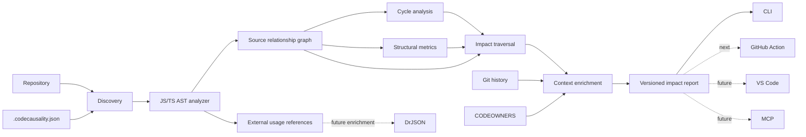

# CodeCausality Architecture

## Principles

1. **Deterministic core first.** Baseline analysis must work without AI or network access.
2. **Change intelligence, not package intelligence.** Package ecosystem analysis belongs to DrJSON.
3. **Evidence before explanation.** AI can explain facts produced by the graph, but never becomes the source of truth for baseline relationships.
4. **Thin adapters.** CLI, GitHub Action, VS Code and MCP consume the same core contracts.
5. **Stable reports.** Automation should consume a versioned report instead of rebuilding analysis logic.
6. **Language analyzers are replaceable.** JavaScript/TypeScript is the first analyzer; additional languages plug into the same graph model.

## Current flow



## Package responsibilities

### `@codecausality/core`

Owns repository discovery, source relationship extraction, graph algorithms, structural metrics, Git change/history evidence, CODEOWNERS resolution, module impact and report contracts. It must not depend on VS Code, GitHub APIs, LLM SDKs, package registries or DrJSON.

### `@codecausality/cli`

A thin local adapter for `scan` and `impact` workflows. It handles terminal rendering and persisting core report objects.

## Report boundary

The stable impact report is the integration seam for future automation. GitHub Actions, VS Code and MCP should consume or render this contract rather than independently recompute ownership, history or blast-radius logic.

## Integration seam with DrJSON

`ExternalReference` remains intentionally shallow:

```ts
{
  from: 'src/schema.ts',
  specifier: 'zod',
  packageName: 'zod'
}
```

CodeCausality stops there. Future enrichment can join this reference with DrJSON data without creating package-analysis logic inside the CodeCausality core.
