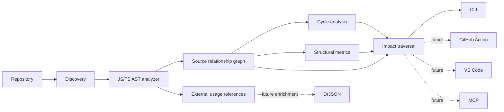

# CodeCausality Architecture

## Principles

1. **Deterministic core first.** Baseline analysis must work without AI or network access.
2. **Change intelligence, not package intelligence.** Package ecosystem analysis belongs to DrJSON.
3. **Evidence before explanation.** AI can explain facts produced by the graph, but never becomes the source of truth for baseline relationships.
4. **Thin adapters.** CLI, GitHub Action, VS Code and MCP consume the same core contracts.
5. **Language analyzers are replaceable.** v0.1 implements JavaScript/TypeScript relationships; additional languages should plug into the same graph model.

## Current flow



## Package responsibilities

### `@codecausality/core`

Owns repository discovery, source relationship extraction, graph algorithms, structural metrics and change impact. It must not depend on VS Code, GitHub APIs, LLM SDKs, package registries or DrJSON.

### `@codecausality/cli`

A thin local adapter for `scan` and `impact` workflows.

## Integration seam with DrJSON

`ExternalReference` is intentionally shallow:

```ts
{
  from: 'src/schema.ts',
  specifier: 'zod',
  packageName: 'zod'
}
```

CodeCausality stops there. Future enrichment can join this reference with DrJSON data without creating package-analysis logic inside the CodeCausality core.
